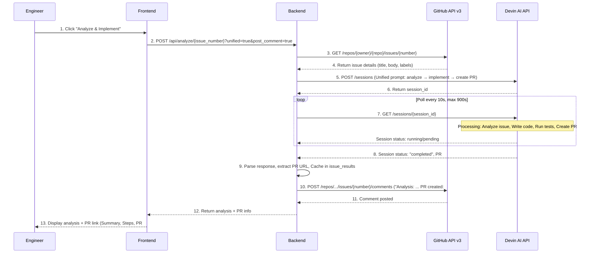
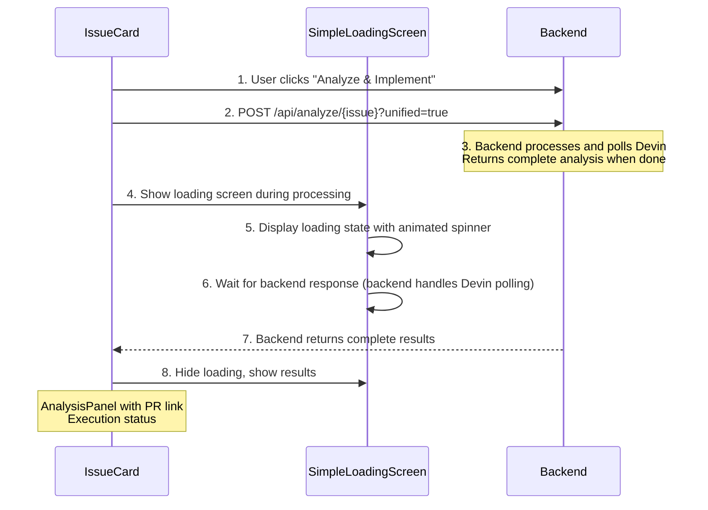
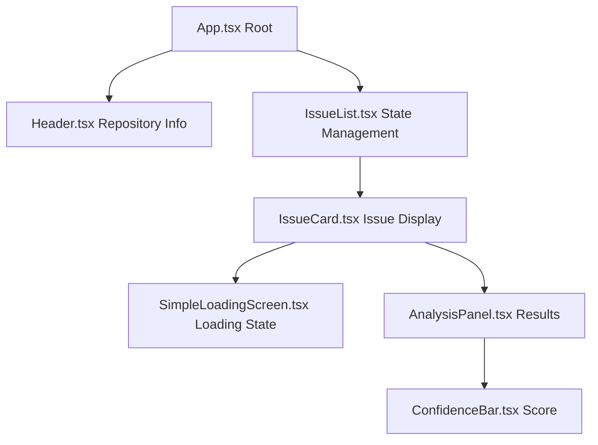

# Devin Issue Assistant

A full-stack web application that integrates GitHub Issues with Devin AI to automatically analyze and implement solutions for repository issues. Built with React, TypeScript, FastAPI, and Python.

## Table of Contents

- [Overview](#overview)
- [Architecture](#architecture)
- [Data Flow](#data-flow)
- [API Reference](#api-reference)
- [Setup & Deployment](#setup--deployment)
- [Usage Guide](#usage-guide)
- [Technical Details](#technical-details)
- [Future Enhancements](#future-enhancements)

---

## Overview

The Devin Issue Assistant streamlines issue resolution for engineering teams by:

- **Listing GitHub issues** with state filtering (open, closed, all)
- **Analyzing issues** using Devin AI with confidence scores, implementation plans, and complexity assessments
- **Executing solutions** automatically with pull request generation
- **Tracking progress** with real-time polling and session monitoring
- **Maintaining context** through in-memory caching and optional GitHub comment posting

### Key Features

- **Unified Analysis + Implementation**: Single-click workflow that analyzes and implements solutions
- **Separate Analysis & Execution**: Optional two-step process for manual review
- **Real-time Status Polling**: Frontend polls every 5 seconds with intelligent timeout handling
- **Fallback Mechanisms**: Heuristic-based analysis when Devin API is unavailable
- **Confidence Scoring**: Visual indicators (0-100%) with color-coded thresholds
- **Session Tracking**: Direct links to Devin UI for detailed session inspection

---

## Architecture

### System Overview

```
flowchart TB
    User[User / Engineer]
    Frontend[FRONTEND LAYER<br/>React 18 + TypeScript + Vite + Tailwind CSS<br/>Port: 5173]
    FrontendComponents[App.tsx<br/>IssueList.tsx<br/>IssueCard.tsx<br/>SimpleLoadingScreen.tsx<br/>AnalysisPanel.tsx<br/>ConfidenceBar.tsx<br/>api.ts]
    Backend[BACKEND LAYER<br/>FastAPI + Python 3.11 + Uvicorn<br/>Port: 8000]
    BackendModules[main.py: 9 REST API endpoints<br/>config.py: Settings management<br/>github_service.py: GitHub API wrapper<br/>devin_service.py: Devin API wrapper]
    GitHub[GitHub REST API v3<br/>GET /repos/.../issues<br/>POST /repos/.../issues//comments<br/>Auth: Bearer token]
    Devin[Devin AI API v1<br/>POST /sessions<br/>GET /sessions//id<br/>Auth: Bearer token]

    User -->|HTTP/REST| Frontend
    Frontend --> FrontendComponents
    Frontend -->|HTTP/REST Axios| Backend
    Backend --> BackendModules
    Backend -->|HTTP/REST requests| GitHub
    Backend -->|HTTP/REST requests| Devin

```

### Directory Structure

```
take-home/
├── backend/
│   ├── main.py                  # FastAPI app with 9 endpoints
│   ├── config.py                # Settings management
│   ├── github_service.py        # GitHub API wrapper
│   ├── devin_service.py         # Devin API wrapper (1160 lines)
│   ├── requirements.txt         # Python dependencies
│   └── Dockerfile               # Backend container config
│
├── frontend/
│   ├── src/
│   │   ├── components/
│   │   │   ├── App.tsx                      # Root component with health check
│   │   │   ├── Header.tsx                   # Repository header
│   │   │   ├── IssueList.tsx                # Issue manager with filtering
│   │   │   ├── IssueCard.tsx                # Issue display with actions
│   │   │   ├── SimpleLoadingScreen.tsx      # Polling screen (361 lines)
│   │   │   ├── AnalysisPanel.tsx            # Analysis results display
│   │   │   └── ConfidenceBar.tsx            # Score visualization
│   │   ├── services/
│   │   │   └── api.ts                       # API client + TypeScript types
│   │   ├── main.tsx                         # React entry point
│   │   └── index.css                        # Tailwind CSS styles
│   ├── package.json                         # Node dependencies
│   ├── tsconfig.json                        # TypeScript configuration
│   ├── vite.config.ts                       # Vite bundler config
│   └── Dockerfile                           # Frontend container config
│
├── docker-compose.yml                       # Multi-container orchestration
├── .env                                     # Environment variables (not in git)
└── README.md                                # Project documentation
```

---

## Data Flow

### Complete Unified Workflow (Analysis + Implementation)



### Frontend Polling Flow



### Data Models

#### Backend (Python/Pydantic)

**AnalysisResult** (main.py):
- `session_id`: string
- `summary`: string
- `confidence`: float
- `steps`: List[str]
- `status`: string

**ExecutionResult** (main.py):
- `session_id`: string
- `status`: string
- `message`: string
- `session_url`: Optional[string]

#### Frontend (TypeScript)

**Analysis** (api.ts):
- `session_id`: string
- `summary`: string
- `confidence`: number
- `steps`: string[]
- `complexity`: string (optional)
- `potential_challenges`: string[] (optional)
- `success_criteria`: string[] (optional)
- `status`: string
- `note`: string (optional) - "Fallback used" indicator
- `session_url`: string (optional) - Link to Devin UI
- `type`: string (optional) - "unified" or "analysis"
- `implementation_status`: string (optional)
- `pr_url`: string (optional) - GitHub PR URL
- `pr_number`: string (optional)

**GitHubIssue** (api.ts):
- `number`: number
- `title`: string
- `body`: string
- `state`: string
- `html_url`: string
- `user`: object with `login` and `avatar_url`
- `labels`: array of objects with `name` and `color`
- `created_at`: string
- `updated_at`: string
- `analysis`: Analysis (optional)
- `execution`: Execution (optional)

---

## API Reference

### Backend REST API

**Base URL**: `http://localhost:8000`

#### Health Check

| Endpoint | Method | Description | Response |
|----------|--------|-------------|----------|
| `/` | GET | Root health check | `{message, status, version}` |
| `/health` | GET | Configuration validation | `{status, configuration, repo}` |
| `/api/health` | GET | Same as `/health` | `{status, configuration, repo}` |

#### Issues

| Endpoint | Method | Query Params | Description | Response |
|----------|--------|--------------|-------------|----------|
| `/api/issues` | GET | `state: open\|closed\|all` | List repository issues | `{success, count, issues[]}` |
| `/api/issues/{issue_number}` | GET | - | Get specific issue | `{success, issue}` |

#### Analysis & Execution

| Endpoint | Method | Query Params | Description | Response |
|----------|--------|--------------|-------------|----------|
| `/api/analyze/{issue_number}` | POST | `post_comment: bool`<br>`unified: bool` | Analyze issue with Devin<br>Unified=true: analyze + implement | `{success, issue_number, analysis}` |
| `/api/execute/{issue_number}` | POST | - | Execute implementation plan | `{success, issue_number, execution}` |
| `/api/sessions/{session_id}` | GET | - | Get Devin session status | `{success, session}` |

#### History

| Endpoint | Method | Description | Response |
|----------|--------|-------------|----------|
| `/api/history` | GET | Get all cached results | `{success, count, history[]}` |

### External API Integration

#### GitHub REST API v3

- **Base URL**: `https://api.github.com`
- **Authentication**: `Authorization: Bearer {GITHUB_TOKEN}`
- **Required Scopes**: `repo`, `issues`, `pull_requests`
- **Endpoints Used**:
  - `GET /repos/{owner}/{repo}/issues` - List issues (filters out PRs)
  - `GET /repos/{owner}/{repo}/issues/{number}` - Get issue details
  - `POST /repos/{owner}/{repo}/issues/{number}/comments` - Post comment

#### Devin AI API v1

- **Base URL**: `https://api.devin.ai/v1`
- **Authentication**: `Authorization: Bearer {DEVIN_API_KEY}`
- **Endpoints Used**:
  - `POST /sessions` - Create analysis/execution session
  - `GET /sessions/{session_id}` - Get session status and results
- **Polling Configuration**:
  - Analysis: Poll every 5s, max 300s (5 minutes)
  - Execution/Unified: Poll every 10s, max 900s (15 minutes)
- **Session Status Values**: `running`, `pending`, `claimed`, `completed`, `success`, `failed`, `error`, `blocked`

---

## Setup & Deployment

### Prerequisites

- **Python 3.11+** (Backend)
- **Node.js 20+** (Frontend)
- **Docker & Docker Compose** (Optional, recommended)
- **GitHub Personal Access Token** with scopes: `repo`, `issues`, `pull_requests`
  - Create at: https://github.com/settings/tokens
- **Devin API Key**
  - Obtain from: https://devin.ai

### Environment Configuration

Create a `.env` file in the project root with the following variables:

**Required Configuration:**
- `GITHUB_TOKEN`: GitHub Personal Access Token
- `GITHUB_REPO`: Repository in format `owner/repository-name`
- `DEVIN_API_KEY`: Devin API Key

**Optional Configuration (defaults shown):**
- `FRONTEND_URL`: Frontend URL (default: `http://localhost:5173`)
- `BACKEND_PORT`: Backend port (default: `8000`)

### Docker Deployment (Recommended)

1. **Clone the repository** and navigate to the project directory

2. **Configure environment** by copying `.env.example` to `.env` and editing it with your credentials

3. **Start services** using `docker-compose up --build`

4. **Access the application**:
   - Frontend: http://localhost:5173
   - Backend API: http://localhost:8000
   - API Documentation: http://localhost:8000/docs

5. **Stop services** using `docker-compose down`

### Local Development Setup

#### Backend

1. Navigate to the `backend` directory
2. Create a virtual environment using `python -m venv venv`
3. Activate the virtual environment (On Windows: `venv\Scripts\activate`)
4. Install dependencies using `pip install -r requirements.txt`
5. Run the server using `uvicorn main:app --reload --port 8000`

Backend runs at http://localhost:8000

#### Frontend

1. Navigate to the `frontend` directory
2. Install dependencies using `npm install`
3. Run the development server using `npm run dev`

Frontend runs at http://localhost:5173

### Docker Configuration Details

**Backend Container** (backend/Dockerfile):
- Base Image: `python:3.11-slim`
- Port: 8000
- Command: `uvicorn main:app --host 0.0.0.0 --port 8000 --reload`
- Volume: `./backend:/app` (hot reload)

**Frontend Container** (frontend/Dockerfile):
- Base Image: `node:20-alpine`
- Port: 5173
- Command: `npm run dev -- --host`
- Volume: `./frontend:/app` (hot reload)
- Environment: `VITE_API_URL=http://localhost:8000/api`

---

## Usage Guide

### 1. View Issues

- Open the application at http://localhost:5173
- Issues are automatically loaded on page load
- Use filter buttons to toggle between:
  - **Open**: Active issues only
  - **Closed**: Resolved issues
  - **All**: All issues

### 2. Analyze Issue

**Single-Click Unified Workflow** (Recommended):
1. Click **"Analyze & Implement"** button on any issue
2. Loading screen appears with status updates
3. Devin AI performs:
   - Analysis (summary, confidence, steps, challenges)
   - Implementation (code changes, tests)
   - Pull request creation
4. Results display with:
   - Confidence score (color-coded bar)
   - Implementation steps (numbered list)
   - Potential challenges
   - Success criteria
   - PR link (clickable GitHub URL)
   - Session link (Devin UI inspection)

**Two-Step Workflow** (Manual Review):
1. Click **"Analyze"** button
2. Review analysis results
3. Click **"Execute Plan"** to proceed with implementation

### 3. Track Progress

- **Loading Screen** shows during processing
- **Backend Polling**: Backend polls Devin every 5-10 seconds
- **Timeout Handling**:
  - Analysis: 5 minutes
  - Execution/Unified: 15 minutes
- **Session URL**: Click to view detailed Devin session logs

### 4. View Results

**Analysis Panel** displays:
- **Summary**: What needs to be done
- **Confidence Score**: 0-100% with visual bar
  - 0-30%: Red (Very Low)
  - 31-50%: Orange (Low)
  - 51-70%: Yellow (Medium)
  - 71-85%: Light Green (High)
  - 86-100%: Green (Very High)
- **Complexity**: Low/Medium/High badge
- **Implementation Steps**: Ordered action list
- **Potential Challenges**: Warning indicators
- **Success Criteria**: Checkmark list
- **Execution Status**: PR creation status
- **Fallback Notice**: If heuristic analysis was used

### 5. GitHub Integration

- **Automatic Comments** (optional):
  - Posted when `post_comment=true`
  - Includes analysis summary and PR link
  - Markdown formatted for readability
- **Pull Request Links**: Direct GitHub navigation
- **Issue Context**: Full issue details displayed

---

## Technical Details

### Backend Architecture

**FastAPI Application** (main.py:297):
- **CORS Middleware**: Restricted to frontend URLs
- **In-Memory Caching**: `issue_results` dictionary stores analysis/execution by issue number
- **Logging**: Comprehensive request/response logging
- **Error Handling**: Try/catch blocks with HTTP exception mapping

**Configuration Management** (config.py):
- **Settings Class**: Validates all required environment variables on startup
- **Singleton Pattern**: Global `settings` instance
- **Property Methods**: Dynamic header generation for API requests

**GitHub Service** (github_service.py):
- **PR Filtering**: Automatically excludes pull requests from issue lists
- **Comment Formatting**: Markdown generation for analysis results
- **Error Handling**: Graceful handling of API rate limits and network errors

**Devin Service** (devin_service.py:1160):
- **Session Types**:
  1. `create_analysis_session()`: Analysis only
  2. `create_unified_session()`: Analysis + Implementation in one
  3. `create_execution_session()`: Implementation only (requires prior analysis)
- **Polling Strategy**:
  - Analysis: 5s interval, 300s timeout
  - Execution/Unified: 10s interval, 900s timeout
- **Response Parsing**: Multi-stage parsing with JSON extraction and text fallback
- **Fallback Mechanisms**:
  - Heuristic confidence calculation based on issue metadata
  - Generic implementation steps generation
  - Error-tolerant response parsing

### Frontend Architecture

**React Component Hierarchy**:



**State Management**:
- **Local State**: React `useState` hooks in each component
- **Props Drilling**: Parent-to-child communication via props
- **Callback Props**: Child-to-parent updates via `onUpdate` callbacks

**API Client** (api.ts):
- **Axios HTTP Client**: Centralized request handling
- **Base URL**: Configured via `VITE_API_URL` environment variable
- **Type Safety**: Full TypeScript interfaces for all API responses
- **Error Handling**: Try/catch blocks with user-friendly error messages

**Loading Implementation** (SimpleLoadingScreen.tsx:361):
- **Loading State Display**: Shows animated spinner during processing
- **Backend Polling**: Backend handles Devin API polling internally
- **Timeout Handling**: Contextual error messages for long-running operations
- **Completion Callback**: `onComplete` prop for parent notification

### Key Technologies

**Backend**:
- `fastapi==0.104.1` - Modern async web framework
- `uvicorn[standard]==0.24.0` - ASGI server with WebSocket support
- `requests==2.31.0` - HTTP library for external API calls
- `pydantic==2.5.0` - Data validation and settings management
- `python-dotenv==1.0.0` - Environment variable loading

**Frontend**:
- `react@18.2.0` - UI library with concurrent features
- `typescript@5.x` - Static type checking
- `vite@5.x` - Fast build tool and dev server
- `axios@1.6.2` - Promise-based HTTP client
- `tailwindcss@3.x` - Utility-first CSS framework

### Security Considerations

1. **Credential Management**:
   - All secrets in environment variables
   - `.env` excluded from version control
   - No hardcoded tokens or keys

2. **CORS Configuration**:
   - Restricted to localhost origins by default
   - Configurable via `FRONTEND_URL` environment variable

3. **Input Validation**:
   - Pydantic models validate all request payloads
   - FastAPI path parameters type-checked
   - Frontend TypeScript interfaces enforce type safety

4. **API Authentication**:
   - Bearer token authentication for GitHub and Devin APIs
   - Token validation on backend startup

5. **Production Recommendations**:
   - Use HTTPS for all communications
   - Implement rate limiting (e.g., via nginx or FastAPI middleware)
   - Add authentication/authorization for multi-user deployments
   - Use secrets management service (AWS Secrets Manager, Azure Key Vault)
   - Enable database persistence instead of in-memory cache

### Monitoring & Debugging

**Backend Logging**:

Configured in main.py with `logging.basicConfig(level=logging.INFO)` and `logger = logging.getLogger(__name__)`.

Logs include:
- Incoming requests
- GitHub API calls
- Devin API calls and responses
- Session status polling
- Response parsing steps
- Error traces

**API Documentation**:
- FastAPI auto-generates interactive docs
- Swagger UI: http://localhost:8000/docs
- ReDoc: http://localhost:8000/redoc

**Frontend Debugging**:
- React DevTools for component inspection
- Browser console for API responses
- Network tab for request/response inspection

---

## Future Enhancements

### High Priority

- **Database Persistence**: Replace in-memory cache with PostgreSQL or MongoDB
  - Store analysis history
  - Enable multi-instance deployments
  - Add query capabilities for analytics

- **Authentication & Authorization**: Multi-user support with role-based access control
  - OAuth integration (GitHub, Google)
  - User-specific issue tracking
  - Admin dashboard

- **Webhook Integration**: Real-time updates from GitHub and Devin
  - Eliminate polling overhead
  - Instant status notifications
  - Event-driven architecture

- **Test Suite**: Comprehensive testing coverage
  - Backend: pytest with API endpoint tests
  - Frontend: Jest + React Testing Library
  - Integration tests with mocked external APIs
  - CI/CD pipeline integration

### Medium Priority

- **Batch Processing**: Analyze multiple issues simultaneously
  - Queue management
  - Parallel session creation
  - Bulk status updates

- **Issue Prioritization**: ML-based urgency scoring
  - Label-based classification
  - Historical resolution time analysis
  - Team capacity estimation

- **Notification System**: Email and Slack integration
  - Analysis completion alerts
  - PR creation notifications
  - Error/failure alerts

- **Analytics Dashboard**: Visualize metrics and trends
  - Issue resolution rates
  - Confidence score distributions
  - Devin session success rates
  - Time-to-resolution charts

### Low Priority

- **Custom Prompt Templates**: User-configurable analysis prompts
  - Repository-specific instructions
  - Coding style guidelines
  - Framework preferences

- **Issue Template Integration**: Parse structured issue forms
  - Extract bug report fields
  - Feature request categorization
  - Automated tag assignment

- **Multi-Repository Support**: Manage issues across multiple repos
  - Repository selection UI
  - Cross-repo analytics
  - Unified issue dashboard

- **AI Model Selection**: Choose between different Devin models
  - Cost vs. performance trade-offs
  - Task-specific model routing
  - Model A/B testing

---

## Troubleshooting

### Backend Issues

**"Configuration Error" on startup**:
- Verify `.env` file exists and contains all required variables
- Check token validity using curl with Authorization header to https://api.github.com/user
- Ensure `GITHUB_REPO` format is `owner/repo` (not full URL)

**"Failed to fetch issues"**:
- Verify GitHub token has `repo` scope
- Check repository name spelling
- Confirm repository exists and is accessible

**"Devin session timeout"**:
- Complex issues may exceed timeout limits
- Check session status directly in Devin UI
- Increase timeout in `devin_service.py` if needed

### Frontend Issues

**"Backend not responding"**:
- Verify backend is running by checking http://localhost:8000/health
- Check `VITE_API_URL` in frontend environment
- Inspect browser console for CORS errors

**"Loading screen stuck"**:
- Check browser network tab for failed requests
- Verify backend is processing the request
- Check backend logs for Devin API errors

**"Analysis not displaying"**:
- Verify analysis was cached in backend by checking http://localhost:8000/api/history
- Check browser console for JavaScript errors
- Refresh page to reload issue data

### Docker Issues

**"Port already in use"**:

Find and kill the process using port 8000 or 5173. On Unix systems, use `lsof -ti:8000 | xargs kill -9` and `lsof -ti:5173 | xargs kill -9`. On Windows, use `netstat` to find the process ID and `taskkill` to terminate it.

**"Container build failed"**:
- Verify Docker daemon is running
- Check Dockerfile syntax
- Clear Docker cache using `docker-compose build --no-cache`

---
